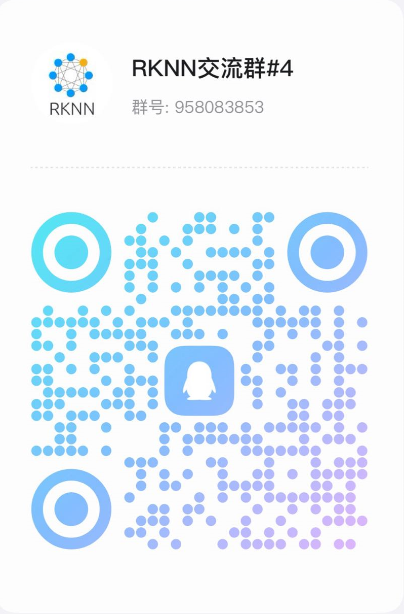

[English](README.md)

# 简介

RKNN3 SDK 提供了将 AI 模型部署到 RK1820/RK1828/RK3572 所需的完整软件栈，包括：

- **[RKNN3-Toolkit](https://github.com/airockchip/rknn3-toolkit)**：PC 端软件开发套件，支持模型转换、推理和性能评估等。
- **RKNN3 Runtime**：板端运行时库，提供 C/C++ 编程接口，用于部署 RKNN 模型并加速 AI 应用。
- **[RKNN3 Model Zoo](https://github.com/airockchip/rknn3-model-zoo)**：模型转换与部署示例仓库，包含 CNN / LLM / VLM 等多种模型的参考实现。

**典型工作流程**：用户首先在 PC 上使用 RKNN3-Toolkit 将训练好的模型转换为 RKNN 格式，然后通过 RKNN3 Runtime API 在开发板上进行推理。

# 支持平台

  - RK1820
  - RK1828
  - RK3572

**注意**： 

-  **对于RK3588/RK3576/RK3568/RK3566/RK3562系列、RV1103/RV1106、RV1103B/RV1106B、RV1126B、RK2118，请参考：** 

    https://github.com/airockchip/rknn-toolkit2      
    
- **对于RK1808/RV1109/RV1126/RK3399Pro，请参考：** 

    https://github.com/airockchip/rknn-toolkit  
    
    https://github.com/airockchip/rknpu 

    https://github.com/airockchip/RK3399Pro_npu  

- **RKNN3 Model Zoo 提供了更多的转换及部署示例**

   https://github.com/airockchip/rknn3-model-zoo

# 支持模型  

 - [x] Qwen2.5-0.5B / 1.5B / 3B / 7B
 - [x] Qwen3-0.6B / 1.7B / 4B / 8B
 - [x] HY-MT1.5-1.8B
 - [x] Youtu-LLM-2B
 - [x] GLM-Edge
 - [x] Qwen2.5-VL-3B / 7B
 - [x] Qwen2.5-Omni-3B (Thinker)
 - [x] Qwen3-VL-2B / 4B
 - [x] FastVLM-1.6B
 - [x] InternVL3-2B
 - [x] InternVL3.5-4B
 - [x] MiMo-VL-7B-RL
 - [x] Gemma4
 - [x] SmolVLM
 - [x] SmolVLM2
 - [x] UI_TARS
 - [x] PaddleOCR VL
 - [x] Qwen3-Reranker-0.6B / 4B
 - [x] Qwen3-Embedding-4B
 - [x] gme-Qwen2-VL-2B
 - [x] Qwen3-ASR
 - [x] Qwen3_TTS
 - [x] VITS
 - [x] Whisper
 - [x] SenseVoice
 - [x] Zipformer
 - [x] SigLIP
 - [x] SigLIP2
 - [x] MetaCLIP2
 - [x] DINOv2
 - [x] DINOv3
 - [x] MobileNetV1 / V2
 - [x] ResNet-50
 - [x] YOLOv5 / YOLOv6 / YOLOv8
 - [x] YOLO-World
 - [x] Diffusion Policy
 - [x] GR00T

# 性能

性能数据请参考 [发布说明](doc/00_Rockchip_RK182X_ReleaseNote_RKNN3_SDK_V1.0.0_CN.pdf)

# 注意事项  

- **RKNN3-Toolkit** 与 [RKNN-Toolkit](https://github.com/airockchip/rknn-toolkit) 和 [RKNN-Toolkit2](https://github.com/airockchip/rknn-toolkit2) **不兼容**。  

# 支持的Python版本：  

  - Python 3.10  
  - Python 3.12  

# 最新版本：V1.0.4

# 更新日志

## V1.0.4
- 新增 RK3572 平台支持 (Beta)
- 新增 Windows 平台支持
- 新增以太网通信类型支持
- 新增设备休眠/唤醒支持
- 新增服务端自动选择通信方式
- 新增流式权重加载支持
- 新增模型加密支持
- 新增 LoRA 支持
- 新增 session 暂停/恢复功能
- 新增 session input callback 功能
- 新增多 session 并行运行支持
- 新增 KVCache 导入/导出接口
- 新增组件版本兼容性校验
- 新增 Qwen3 TTS 语音合成模型
- 新增 Qwen3-ASR 语音识别模型
- 新增 VITS 音频合成模型
- 新增 Zipformer 模型
- 新增 MetaCLIP2 模型
- 新增 Gemma4 多模态模型
- 新增 GR00T 模型
- 新增 PaddleOCR VL 模型
- 新增 SmolVLM2 视觉语言模型

# 反馈与社区支持  

- [Redmine](https://redmine.rock-chips.com) (**推荐反馈问题，请联系销售或FAE获取Redmine账号**)  
- QQ群1：1025468710（已满，请加群5）  
- QQ群2：547021958（已满，请加群5）  
- QQ群3：469385426（已满，请加群5）  
- QQ群4：958083853（已满，请加群5）  
- QQ群5：1077888690

  
    
    
    
    
  

  
